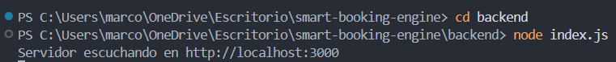
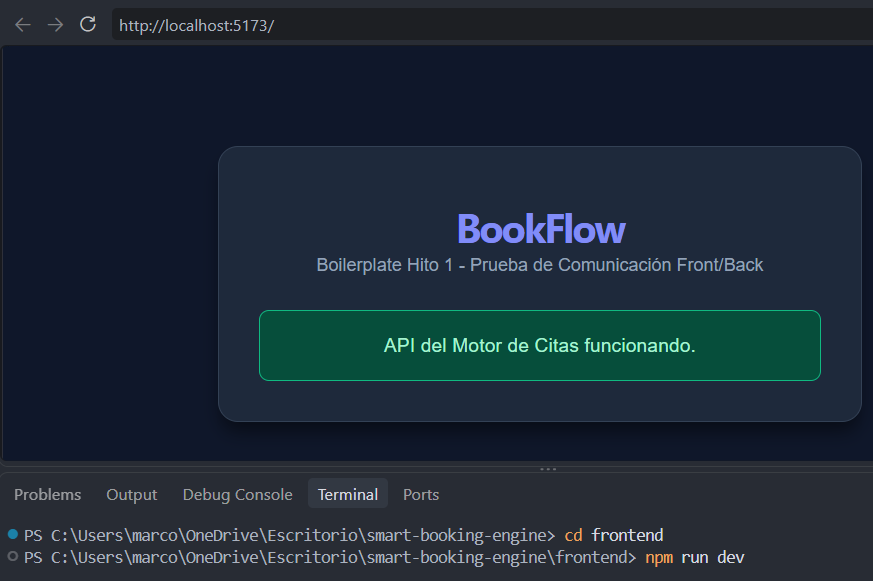

# Documento de Instalación y Configuración - Hito 1

## 1. Configuración del Entorno
* **Backend:** Inicializado con Node.js y Express. Se incorporaron `cors` para habilitar peticiones cruzadas desde el cliente web y `dotenv` para la lectura de variables de entorno.
* **Frontend:** Generado con Vite y Vue 3 (Composition API). Se integró Tailwind CSS v3 para el diseño de la interfaz visual.

## 2. Pruebas de Funcionamiento y Comunicación Front-Back
* El backend arranca en el puerto `3000` y expone el endpoint `GET /api/health`.
* Al acceder a `http://localhost:5173`, la aplicación de Vue realiza una petición asíncrona mediante `fetch` al backend al montarse el componente y renderiza el mensaje de confirmación en color verde.

* *

## 3. Problemas Encontrados y Soluciones
* **Conflicto con la versión de Tailwind CSS:** Al ejecutar el comando de inicialización `npx tailwindcss init -p`, la consola arrojó el error `could not determine executable to run` debido a que npm descargó por defecto Tailwind v4, cuya arquitectura CLI ha cambiado.
* **Solución aplicada:** Se desinstaló dicho paquete y se fijó la versión estable de Tailwind CSS 3 (`npm install -D tailwindcss@3 postcss autoprefixer`), lo que generó correctamente los archivos `tailwind.config.js` y `postcss.config.js`.